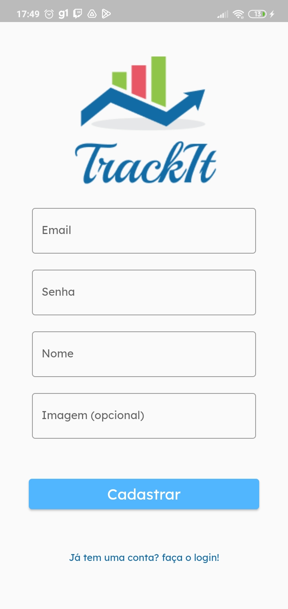
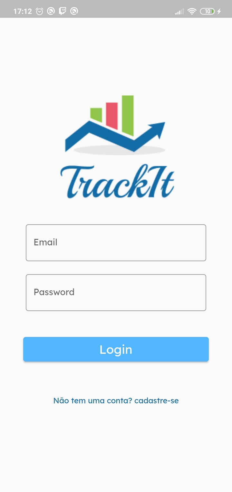
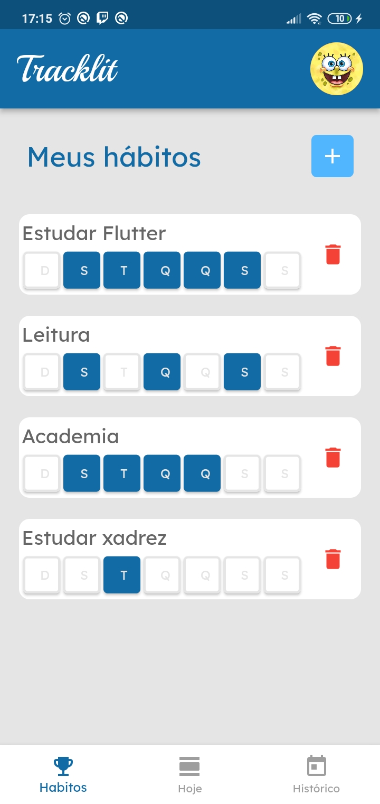
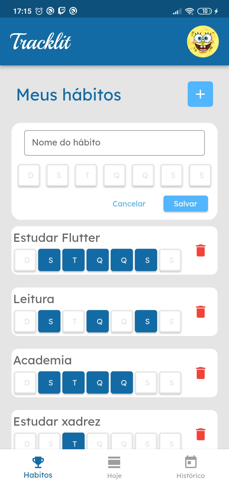
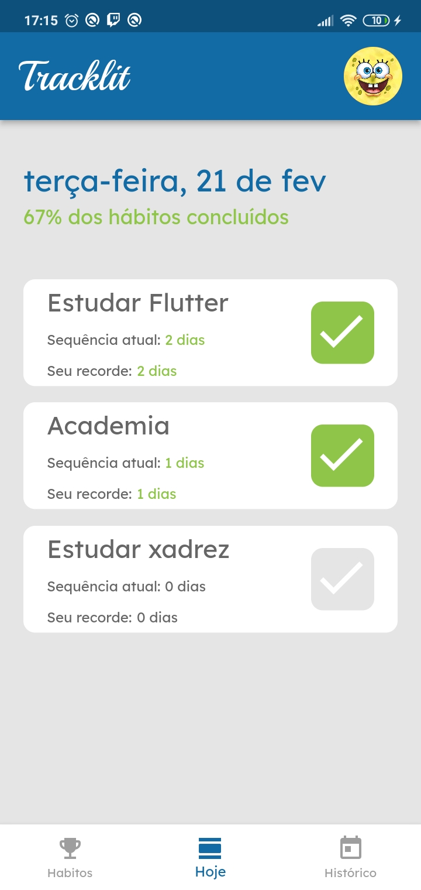
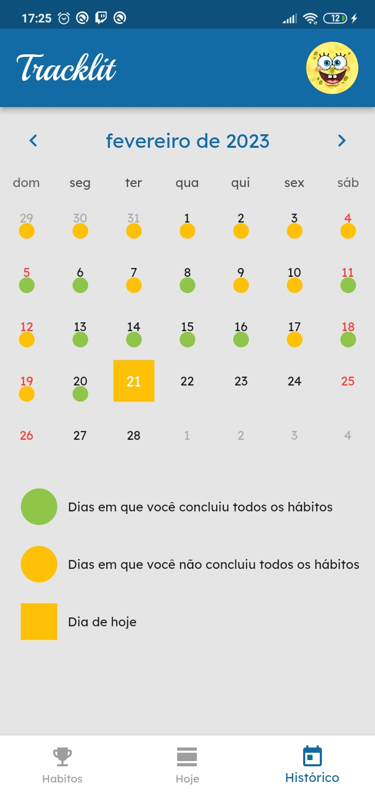

# Tracklit

   

- Esta é uma aplicação web onde você pode gerenciar os seus hábitos
- Você pode criar um hábido, selecionar quais dias você os quer praticar
- Na tela de "Hoje" você consegue: visualizar quais hábitos você tem para praticar, marcar ou desmarcar como feito um hábito
- A aplicação conta com um calendário onde é possível visulizar seu histórico, quais dias você conseguiu ou não praticar todos os hábitos 

***

# Demo

   
   
   
   
   
   

***
# How to usage

- Set the variable "APIURL" in .env as "https://mock-api.bootcamp.respondeai.com.br/api/v2/trackit"

A new Flutter project.

This project is a starting point for a Flutter application.

A few resources to get you started if this is your first Flutter project:

- [Lab: Write your first Flutter app](https://docs.flutter.dev/get-started/codelab)
- [Cookbook: Useful Flutter samples](https://docs.flutter.dev/cookbook)

For help getting started with Flutter development, view the
[online documentation](https://docs.flutter.dev/), which offers tutorials,
samples, guidance on mobile development, and a full API reference.

***

##	 technologies and concepts

- Flutter
- Bloc
- Flutter caledar
- INTL
- communication with the REST API
- Token login

***
    
